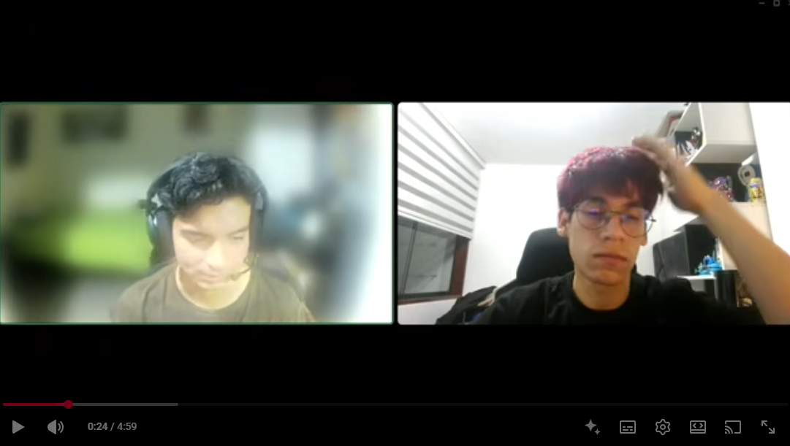
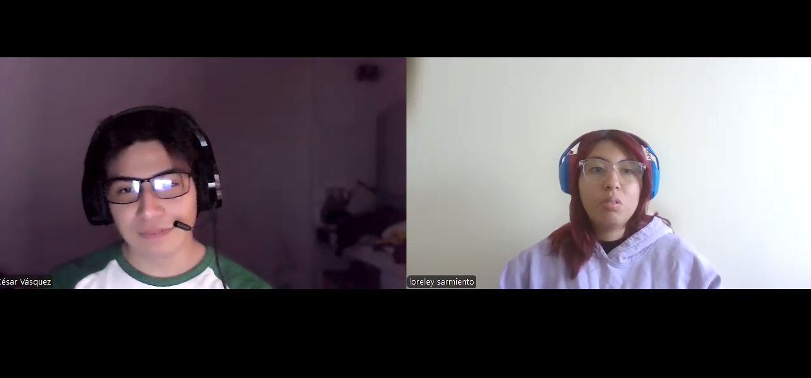
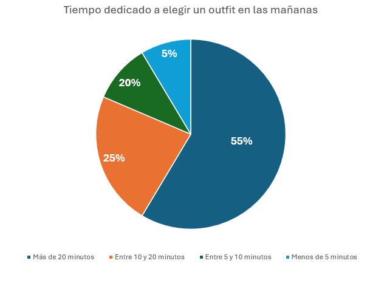
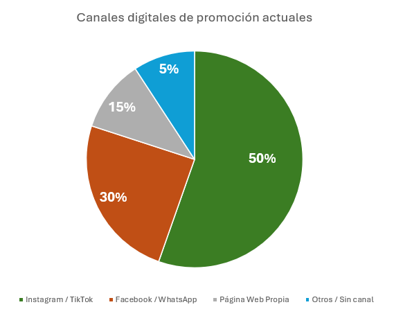

  

<h4>UNIVERSIDAD PERUANA DE CIENCIAS APLICADAS</h4>
<h4>INGENIERIA DE SOFTWARE</h4>
<h4>CICLO 8</h4>
<h4>CURSO:</h4>
<h4>1ASI0728 – ARQUITECTURAS DE SOFTWARE EN TECNOLOGIAS EMERGENTES</h4>
<h4>NRC: 9077</h4>
<h4>PROFESOR(A): Marino Humberto Jara Palacios</h4>
<h4>INFORME DE TB1</h4>
<h4>CICLO: 2026-20</h4>

 

<h4>STARTUP:</h4>
<h4>PRODUCTO:</h4>
<h4>INTEGRANTES:</h4>

- Cabanillas Meza, Jose Mateo (u2023) 
- Ortiz Cardenas, Johanna Antuanete (u202310358) 
- Sánchez Manrique, Italo Ludwing (u2023) 
- Sarmiento Medina, Loreley (u202310005) 
- Zegarra López, Renato Sebastián Rubber (u202311558)

 

<h4>SETIEMBRE - 2026</h4>

 
 
 

## Registro de Versiones del Informe

<table>
  <thead>
    <tr>
      <th>Versión</th>
      <th>Fecha</th>
      <th>Autor</th>
      <th>Descripción de modificación</th>
    </tr>
  </thead>
  <tbody>
    <tr>
      <td>TB1</td>
      <td>17/04/2026</td>
      <td>
        - Cabanillas Meza, Jose Mateo  
        - Ortiz Cardenas, Johanna Antuanete  
        - Sánchez Manrique, Italo Ludwing  
        - Sarmiento Medina, Loreley  
        - Zegarra López, Renato Sebastián Rubber
      </td>
      <td>
        - Capítulo I: Introducción (1.1 – 1.3) 
        - Capítulo II: Requirements & Analysis (2.1 – 2.4) 
        - Capítulo III: Requirements Specification (3.1 – 3.4) 
        - Capítulo IV: Strategic-Level Software Design (4.1 – 4.3)
      </td>
    </tr>
  
  </tbody>
</table>

## **Project Report Collaboration Insights**

TB1 (19/09/2026):

## **STUDENT OUTCOME**

ABET – EAC - Srudent Outcome 3 – Trabajo Multidisciplinario - Capacidad de comunicarse efectivamente con un rango de audiencias.

<table border="1">
<thead>
<tr>
<th>Criterio específico</th>
<th>Acciones realizadas</th>
<th>Conclusiones</th>
</tr>
</thead>
<tbody>
<tr>
<td>3.c1. Comunica oralmente con efectividad a diferentes rangos de audiencia.</td>
<td>
<b>Cabanillas Meza, Jose Mateo</b> 
TB1:  
<b>Ortiz Cardenas, Johanna Antuanete</b> 
TB1:  
<b>Sánchez Manrique, Italo Ludwing</b> 
TB1:  
<b>Sarmiento Medina, Loreley</b> 
TB1:  
<b>Zegarra López, Renato Sebastián Rubber</b> 
TB1:
</td>
<td>TB1: </td>
</tr>
<tr>
<td>3.c2. Comunica por escrito con efectividad a diferentes rangos de audiencia.</td>
<td>
<b>Cabanillas Meza, Jose Mateo</b> 
TB1:  
<b>Ortiz Cardenas, Johanna Antuanete</b> 
TB1:  
<b>Sánchez Manrique, Italo Ludwing</b> 
TB1:  
<b>Sarmiento Medina, Loreley</b> 
TB1:  
<b>Zegarra López, Renato Sebastián Rubber</b> 
TB1:
</td>
<td>TB1: </td>
</tr>
</tbody>
</table>

## **Contenido**

- [STUDENT OUTCOME](#student-outcome)
- [CAPÍTULO I: Introducción](#capítulo-i-introducción)
  - [1.1. Startup Profile](#11-startup-profile)
      - [1.1.1. Descripción de la Startup](#111-descripción-de-la-startup)
      - [1.1.2. Perfiles de integrantes del equipo](#112-perfiles-de-integrantes-del-equipo)
  - [1.2. Solution Profile](#12-solution-profile)
      - [1.2.1. Antecedentes y problemática](#121-antecedentes-y-problemática)
      - [1.2.2. Lean UX Process](#122-lean-ux-process)
        - [1.2.2.1. Lean UX Problem Statements](#1221-lean-ux-problem-statements)
        - [1.2.2.2. Lean UX Assumptions](#1222-lean-ux-assumptions)
        - [1.2.2.3. Lean UX Hypothesis](#1223-lean-ux-hypothesis)
        - [1.2.2.4. Lean UX Canvas](#1224-lean-ux-canvas)
  - [1.3. Segmentos objetivo](#13-segmentos-objetivo)
 
- [CAPÍTULO II: Requirements & Analysis](#capítulo-ii-requirements--analysis)
  - [2.1. Competidores](#21-competidores)
    - [2.1.1 Análisis de Competidores](#211-análisis-de-competidores)
    - [2.1.2. Estrategias frente a competidores](#212-estrategias-frente-a-competidores)
  - [2.2. Entrevistas](#22-entrevistas)
    - [2.2.1 Diseño de entrevistas](#221-diseño-de-entrevistas)
    - [2.2.2 Registro de entrevistas](#222-registro-de-entrevistas)
    - [2.2.3 Análisis de entrevistas](#223-análisis-de-entrevistas)
  - [2.3. Needfinding](#23-needfinding)
    - [2.3.1. User Personas](#231-user-personas)
    - [2.3.2. User Task Matrix](#232-user-task-matrix)
    - [2.3.3. Empathy Mapping](#233-empathy-mapping)
    - [2.3.4. As-is Scenario Mapping](#234-as-is-scenario-mapping)
    - [2.4.	Ubiquitous Language.](#24-ubiquitous-language)
      
 - [CAPÍTULO III: Requirements Specification](#capítulo-iii-requirements-specification)
    - [3.1. To-Be Scenario Mapping](#31-to-be-scenario-mapping)
    - [3.2. User Stories](#32-user-stories)
    - [3.3. Impact Mapping](#33-impact-mapping)
    - [3.4. Product Backlog](#34-product-backlog)
      
 - [CAPÍTULO IV: Strategic-Level Software Design](#capítulo-iv-strategic-level-software-design)
  - [4.1. Strategic-Level Attribute-Driven Design](#41-strategic-level-attribute-driven-design)
    - [4.1.1. Design Purpose](#411-design-purpose)
    - [4.1.2. Attribute-Driven Design Inputs](#412-attribute-driven-design-inputs)
      - [4.1.2.1. Primary Functionality (Primary User Stories)](#4121-primary-functionality-primary-user-stories)
      - [4.1.2.2. Quality Attribute Scenarios](#4122-quality-attribute-scenarios)
      - [4.1.2.3. Constraints](#4123-constraints)
    - [4.1.3. Architectural Drivers Backlog](#413-architectural-drivers-backlog)
    - [4.1.4. Architectural Design Decisions](#414-architectural-design-decisions)
    - [4.1.5. Quality Attribute Scenario Refinements](#415-quality-attribute-scenario-refinements)
  - [4.2. Strategic-Level Domain-Driven Design](#42-strategic-level-domain-driven-design)
    - [4.2.1. EventStorming](#421-eventstorming)
    - [4.2.2. Candidate Context Discovery](#422-candidate-context-discovery)
    - [4.2.3. Domain Message Flows Modeling](#423-domain-message-flows-modeling)
    - [4.2.4. Bounded Context Canvases](#424-bounded-context-canvases)
    - [4.2.5. Context Mapping](#425-context-mapping)
  - [4.3. Software Architecture](#43-software-architecture)
    - [4.3.1. Software Architecture System Landscape Diagram](#431-software-architecture-system-landscape-diagram)
    - [4.3.2. Software Architecture Context Level Diagrams](#432-software-architecture-context-level-diagrams)
    - [4.3.3. Software Architecture Container Level Diagrams](#433-software-architecture-container-level-diagrams)
    - [4.3.4. Software Architecture Deployment Diagrams](#434-software-architecture-deployment-diagrams)

- [Conclusiones](#conclusiones)
- [Conclusiones y Recomendaciones](#conclusiones-y-recomendaciones)
  
- [Bibliografía](#bibliografía)
- [Anexos](#anexos)

# CAPÍTULO I: Introducción

## 1.1. Startup Profile

### 1.1.1. Descripción de la Startup

### 1.1.2. Perfiles de integrantes del equipo

## 1.2. Solution Profile

### 1.2.1. Antecedentes y problemática

### 1.2.2. Lean UX Process

#### 1.2.2.1. Lean UX Problem Statements

#### 1.2.2.2. Lean UX Assumptions

#### 1.2.2.3. Lean UX Hypothesis

#### 1.2.2.4. Lean UX Canvas

## 1.3. Segmentos objetivo

# CAPÍTULO II: Requirements & Analysis

# 2.1. Competidores

## 2.1.1. Análisis de Competidores

### Competitive Analysis Landscape

**¿Por qué llevar a cabo este análisis?**

El análisis de competidores permite conocer cómo las soluciones actuales abordan la organización del armario digital, la recomendación de outfits y la personalización de la experiencia de moda. A partir de esta comparación se pueden identificar funcionalidades ya presentes en el mercado y oportunidades de diferenciación para la solución propuesta.

Para el análisis se seleccionaron Whering, Acloset y XZ(Closet) debido a que comparten características relacionadas con armarios digitales, organización de prendas y generación de combinaciones de ropa.

| Perfil | Aspecto | Solución propuesta | Whering | Acloset | XZ(Closet) |
|---|---|---|---|---|---|
| **Perfil** | **Overview** | Plataforma orientada a la gestión del armario personal mediante herramientas digitales e inteligencia artificial. Busca permitir al usuario organizar sus prendas, generar outfits personalizados y explorar prendas de tiendas que puedan complementar su estilo. También se plantea incorporar experiencias de prueba virtual y realidad aumentada. | Aplicación de armario digital y estilismo social que permite registrar prendas, crear outfits, planificar combinaciones, analizar el uso del armario e interactuar con los armarios de otros usuarios. | Aplicación de armario inteligente que utiliza IA para organizar prendas, recomendar outfits, registrar información automáticamente y apoyar al usuario en decisiones relacionadas con su estilo. | Aplicación de armario digital enfocada en ayudar al usuario a organizar sus prendas y recibir nuevas ideas de combinaciones de manera periódica. |
| **Perfil** | **Ventaja competitiva / ¿Qué valor ofrece?** | Busca integrar en una misma experiencia el armario personal, recomendaciones mediante IA, visualización de prendas y conexión con catálogos de tiendas. La propuesta para las tiendas se centra en aumentar la visibilidad de sus productos y dirigir a los usuarios hacia sus propios canales comerciales. | Cuenta con una fuerte orientación social y comunitaria. Permite explorar otros armarios, compartir outfits y analizar estadísticas como frecuencia de uso y costo por uso de las prendas. | Su principal fortaleza está en la automatización mediante IA. Puede reconocer información de las prendas, recomendar outfits e importar productos desde historiales de compra y páginas de tiendas. | Se caracteriza por una experiencia sencilla enfocada en generar ideas de outfits utilizando las prendas disponibles en el armario del usuario. |
| **Perfil de Marketing** | **Mercado objetivo** | Jóvenes interesados en moda y herramientas digitales, inicialmente entre 18 y 29 años. Como segundo segmento, tiendas de ropa y accesorios interesadas en obtener mayor visibilidad para sus productos. | Personas interesadas en organizar su guardarropa, crear outfits, compartir estilos y aprovechar mejor las prendas que poseen. | Usuarios interesados en utilizar inteligencia artificial para administrar su guardarropa, recibir recomendaciones de estilo y planificar outfits. | Hombres y mujeres que buscan organizar digitalmente sus prendas y recibir ideas para combinarlas. |
| **Perfil de Marketing** | **Estrategias de marketing / posicionamiento** | Posicionamiento centrado en personalización, uso del armario propio e integración entre usuarios y tiendas. Se plantea complementar la captación digital con alianzas con tiendas y experiencias mediante QR. | Su comunicación se enfoca en aprovechar mejor el armario, la comunidad, el intercambio de inspiración y una relación más consciente con la moda. | Su posicionamiento se centra principalmente en la inteligencia artificial, automatización del armario y reducción del esfuerzo necesario para organizar prendas y decidir qué vestir. | Su propuesta se comunica alrededor de una necesidad cotidiana: tener prendas disponibles pero no saber cómo combinarlas. Destaca la generación automática de ideas de outfits. |
| **Perfil de Producto** | **Productos y servicios** | - Armario digital - Registro y clasificación de prendas - Recomendaciones personalizadas de outfits - Organización y guardado de combinaciones - Catálogo de tiendas aliadas - Incorporación de prendas comerciales al armario - Avatar y probador virtual propuestos - Experiencias de realidad aumentada propuestas - Funciones sociales | - Armario digital - Carga de prendas mediante fotografías, base de datos y navegador - Creación y planificación de outfits - Estadísticas del armario - Listas de deseos y moodboards - Funciones sociales - Armarios compartidos - Herramientas para viajes y planificación | - Armario digital con IA - Clasificación automática de prendas - Recomendación de outfits mediante IA - Estadísticas de estilo - Importación desde tiendas online - Extensión para navegador - Lista de deseos - Funciones de estilista mediante IA - Funciones de prueba virtual disponibles dentro de determinados planes | - Armario digital - Registro de prendas - Eliminación de fondo y recorte de imágenes - Ideas automáticas de outfits - Administración de prendas - Recomendaciones periódicas de combinaciones |
| **Perfil de Producto** | **Precios y costos** | El modelo de monetización todavía se encuentra en etapa de definición y validación. No se ha establecido un precio definitivo para usuarios o tiendas. | Aplicación gratuita con compras dentro de la aplicación y servicios adicionales de pago. | Permite utilizar gratuitamente determinadas funciones hasta un límite de 100 prendas. Posteriormente requiere suscripción. En Perú, App Store muestra planes Básico, Premium y Experto con diferentes precios. | Aplicación gratuita con publicidad y compras dentro de la aplicación. En la App Store peruana aparecen opciones de pago desde aproximadamente S/ 2.90. |
| **Perfil de Producto** | **Canales de distribución** | - Aplicación móvil - Landing page informativa - Integración con tiendas aliadas - Códigos QR en establecimientos físicos como canal complementario | - Aplicación móvil - Sitio web - Extensión de navegador | - Aplicación móvil - Plataforma y extensión para navegador - Integraciones con tiendas online | - Aplicación móvil para iOS/iPadOS - Aplicación Android |
| **Análisis SWOT** | **Fortalezas** | Propuesta que busca conectar el armario personal con recomendaciones inteligentes y productos provenientes de tiendas. La integración B2C y B2B permite generar valor tanto para usuarios como para comercios. Las funcionalidades planteadas de avatar, QR y AR pueden aportar una experiencia diferenciada si se validan correctamente. | Comunidad amplia y consolidada, con más de 10 millones de usuarios declarados en su sitio oficial. Cuenta con funciones sociales, estadísticas de uso del guardarropa y diferentes herramientas de planificación. | Cuenta con más de 8 millones de usuarios declarados y presenta un fuerte uso de IA para automatizar el registro de prendas, generar recomendaciones y facilitar la incorporación de productos desde tiendas online. | Propuesta sencilla y directa para personas que buscan ideas de outfits. Permite añadir prendas rápidamente y recibir recomendaciones automáticas sin requerir una configuración demasiado compleja. |
| **Análisis SWOT** | **Debilidades** | La solución se encuentra en una etapa temprana y todavía no cuenta con una comunidad consolidada. Además, funcionalidades como IA, avatar, estimación corporal y AR incrementan considerablemente la complejidad técnica. El valor para las tiendas dependerá también de alcanzar una cantidad suficiente de usuarios. | La propuesta pública está fuertemente orientada al usuario final y a la comunidad. En las fuentes revisadas no se observa una propuesta B2B equivalente en la que las tiendas administren directamente un catálogo para obtener visibilidad dentro de la plataforma. | El acceso gratuito tiene límites y algunas funciones dependen de planes de suscripción. Su amplia cantidad de herramientas puede aumentar la cantidad de opciones que un usuario debe conocer y configurar. | Frente a Whering y Acloset, la propuesta pública presenta una menor amplitud de funciones relacionadas con IA avanzada, comunidad o integración comercial. En App Store se encuentra disponible principalmente en inglés y japonés. |
| **Análisis SWOT** | **Oportunidades** | Diferenciarse mediante la integración con tiendas locales, visibilidad de catálogos, códigos QR, personalización y experiencias de prueba virtual. También existe la oportunidad de adaptar la plataforma al contexto peruano y posteriormente latinoamericano. | Puede profundizar la integración con comercios y experiencias de prueba virtual para conectar su comunidad con productos externos. | Puede ampliar su modelo hacia una relación más directa con tiendas y marcas que quieran promocionar sus catálogos dentro de la experiencia del usuario. | Puede incorporar mayor personalización mediante IA, nuevas funciones sociales, idiomas adicionales y una mayor integración con tiendas. |
| **Análisis SWOT** | **Amenazas** | Whering y Acloset ya cuentan con millones de usuarios y funcionalidades de armario digital consolidadas. La rápida evolución de soluciones basadas en IA puede reducir la diferenciación si las funcionalidades propuestas no generan un valor claramente perceptible. | Competidores como Acloset están ampliando rápidamente sus capacidades de IA e integración con tiendas online. | Existe una alta competencia entre aplicaciones de armario digital e IA, y otras soluciones pueden incorporar rápidamente funciones similares de automatización. | Competidores con ecosistemas más completos, mayor personalización y capacidades de IA pueden atraer a los usuarios que buscan una experiencia más avanzada. |

## 2.1.2. Estrategias frente a competidores

### Personalización basada en el armario real del usuario

**Estrategia:** Diferenciar la experiencia utilizando las prendas que el usuario realmente posee como base para las recomendaciones.

**Táctica:** Utilizar la información registrada en el armario, las preferencias de estilo y las interacciones anteriores para generar outfits personalizados y permitir que el usuario refine las recomendaciones mediante comentarios o selecciones.

### Integración directa con tiendas de moda

**Estrategia:** Diferenciarse de aplicaciones centradas únicamente en el usuario mediante la incorporación de tiendas como segundo segmento dentro de la plataforma.

**Táctica:** Permitir que las tiendas aliadas creen un perfil profesional, publiquen prendas y accesorios de su catálogo e incluyan enlaces hacia sus propios canales oficiales. Las prendas podrán aparecer dentro de espacios de descubrimiento y ser utilizadas por los usuarios como referencia junto con su armario personal.

### Visibilidad de productos sin convertirse en marketplace

**Estrategia:** Ofrecer a las tiendas un nuevo canal de exposición sin asumir directamente el proceso de compra y venta.

**Táctica:** Cada prenda comercial podrá incluir información de la tienda y un acceso hacia su sitio web, red social o canal de venta. De esta manera, la plataforma genera descubrimiento y tráfico mientras la transacción continúa realizándose en el canal oficial de la tienda.

### Conexión entre tienda física y experiencia digital mediante QR

**Estrategia:** Integrar la experiencia presencial de las tiendas con las herramientas digitales de la plataforma.

**Táctica:** Permitir que las tiendas generen códigos QR asociados a determinadas prendas. El usuario podrá escanearlos para consultar el producto, incorporarlo a su armario virtual como referencia o utilizarlo dentro de las herramientas de combinación y prueba disponibles.

### Experiencia de prueba virtual

**Estrategia:** Complementar la organización del armario y las recomendaciones con una experiencia visual que permita experimentar con diferentes prendas y accesorios.

**Táctica:** Desarrollar progresivamente funcionalidades de avatar, probador virtual y realidad aumentada que permitan visualizar determinados artículos antes de utilizarlos o acceder al canal de la tienda.

Estas funcionalidades deberán validarse técnicamente y con usuarios antes de considerarse un diferenciador definitivo.

### Reducción del esfuerzo necesario para crear el armario digital

**Estrategia:** Reducir una de las principales barreras de las aplicaciones de armario: el tiempo necesario para registrar todas las prendas.

**Táctica:** Utilizar procesamiento de imágenes e inteligencia artificial para reconocer automáticamente información como tipo de prenda, categoría y color, permitiendo que el usuario revise y corrija los datos antes de guardarlos.

También se plantea permitir la incorporación rápida de prendas comerciales mediante códigos QR.

### Recomendaciones que evolucionen con el usuario

**Estrategia:** Evitar que el sistema funcione únicamente como un generador estático de outfits.

**Táctica:** Permitir que el usuario guarde, descarte y modifique recomendaciones. Estas interacciones podrán utilizarse para conocer mejor sus preferencias y mejorar progresivamente las sugerencias posteriores.

### Construcción de una comunidad alrededor del estilo

**Estrategia:** Complementar el armario individual con una experiencia social que permita obtener inspiración de otras personas.

**Táctica:** Permitir que los usuarios hagan públicas determinadas prendas u outfits, sigan a otros perfiles, reaccionen a combinaciones y exploren prendas disponibles públicamente en otros armarios.

### Adaptación inicial al mercado local

**Estrategia:** Desarrollar inicialmente una propuesta cercana al contexto del usuario peruano y a tiendas que necesiten nuevos canales digitales de visibilidad.

**Táctica:** Buscar alianzas con tiendas locales, trabajar con usuarios del segmento definido durante las primeras pruebas y adaptar progresivamente la experiencia según los resultados obtenidos.

La expansión hacia otros mercados deberá realizarse después de validar la propuesta de valor en el mercado inicial.

## 2.2. Entrevistas

De acuerdo con Easwaramoorthy y Zarinpoush (2006), las entrevistas son un método de investigación en el que se lleva a cabo una conversación orientada a recolectar información. A través de este método, se plantean una serie de preguntas que permiten conocer con mayor profundidad las experiencias, necesidades, comportamientos y puntos de vista de los participantes respecto a una problemática determinada.

Para Mirage, la información recogida mediante las entrevistas es fundamental para comprender las dificultades que presentan los consumidores de moda al momento de organizar sus prendas, recordar qué tienen disponible, encontrar nuevas formas de combinar su ropa y descubrir prendas que se adapten a su estilo. Asimismo, permitirá conocer las necesidades de las tiendas de ropa relacionadas con la visibilidad de sus productos, la promoción de sus catálogos y el uso de canales digitales para llegar a potenciales clientes.

Por ello, se plantea realizar un total de **3 entrevistas por cada segmento objetivo**, considerando tanto consumidores de moda como representantes de tiendas de ropa. Las entrevistas podrán realizarse de manera presencial o a distancia mediante herramientas digitales como Google Meet, Zoom o Discord, procurando en ambos casos generar un ambiente cómodo y adecuado que permita a los participantes expresar libremente sus experiencias y opiniones.

## 2.2. Entrevistas

De acuerdo con Easwaramoorthy y Zarinpoush (2006), las entrevistas son un método de investigación en el que se lleva a cabo una conversación orientada a recolectar información. A través de este método, se plantean una serie de preguntas que permiten conocer con mayor profundidad las experiencias, necesidades, comportamientos y puntos de vista de los participantes respecto a una problemática determinada.

Para Mirage, la información recogida mediante las entrevistas es fundamental para comprender las dificultades que presentan los consumidores de moda al momento de organizar sus prendas, recordar qué tienen disponible, encontrar nuevas formas de combinar su ropa y descubrir prendas que se adapten a su estilo. Asimismo, permitirá conocer las necesidades de las tiendas de ropa relacionadas con la visibilidad de sus productos, la promoción de sus catálogos y el uso de canales digitales para llegar a potenciales clientes.

Por ello, se plantea realizar un total de **3 entrevistas por cada segmento objetivo**, considerando tanto consumidores de moda como representantes de tiendas de ropa. Las entrevistas podrán realizarse de manera presencial o a distancia mediante herramientas digitales como Google Meet, Zoom o Discord, procurando en ambos casos generar un ambiente cómodo y adecuado que permita a los participantes expresar libremente sus experiencias y opiniones.

### 2.2.1 Diseño de entrevistas

## **Segmento objetivo #1: Consumidores de moda**

### **Preguntas principales:**

- ¿Cómo organizas actualmente las prendas que tienes en tu armario?
- ¿Con qué frecuencia recuerdas qué prendas tienes disponibles al momento de elegir qué vestir?
- ¿Qué dificultades encuentras al momento de elegir un outfit para una ocasión determinada?
- ¿Qué haces actualmente cuando quieres encontrar nuevas formas de combinar las prendas que ya tienes?
- ¿Con qué frecuencia utilizas prendas que tienes guardadas pero que usas poco?
- ¿Has tenido situaciones en las que compraste una prenda y luego descubriste que ya tenías otras prendas similares?
- ¿Qué medios utilizas actualmente para buscar inspiración sobre outfits, estilos o combinaciones de ropa?
- ¿Qué información consideras importante para decidir si una prenda combina con tu estilo o con otras prendas que ya tienes?
- ¿Has utilizado alguna aplicación o herramienta digital para organizar tu ropa, crear outfits o buscar inspiración? ¿Cómo fue tu experiencia?
- ¿Qué características esperarías de una aplicación que te permita registrar y organizar digitalmente las prendas de tu armario?
- ¿Qué tan útil sería para ti recibir sugerencias de outfits basadas en las prendas que ya tienes? ¿Por qué?
- ¿Qué factores considerarías importantes para confiar en las recomendaciones realizadas por una aplicación?
- ¿Qué opinas de poder visualizar digitalmente cómo podría verse una prenda o combinación antes de decidir utilizarla?
- ¿En qué situaciones considerarías útil utilizar realidad aumentada o una representación digital de una prenda?
- ¿Qué información te gustaría encontrar cuando descubres una prenda de una tienda dentro de una aplicación de moda?

### **Preguntas complementarias:**

- ¿Qué tipo de prendas te resulta más difícil combinar?
- ¿Qué haces cuando tienes una prenda que te gusta pero no sabes con qué combinarla?
- ¿Sueles planificar tus outfits con anticipación o decides qué vestir en el momento?
- ¿Qué aplicaciones relacionadas con moda utilizas actualmente y qué es lo que más valoras de ellas?
- ¿Qué haría que dejaras de utilizar una aplicación para organizar tu armario?
- Si pudieras mejorar una sola cosa de la forma en que actualmente eliges tus outfits, ¿qué cambiarías?

## **Segmento objetivo #2: Tiendas de ropa**

### **Preguntas principales:**

- ¿Cómo muestran actualmente sus prendas y productos a sus clientes?
- ¿Qué canales digitales utilizan actualmente para promocionar su catálogo?
- ¿Qué dificultades encuentran al momento de conseguir que sus productos tengan mayor visibilidad?
- ¿Cómo identifican actualmente qué productos generan mayor interés entre sus clientes?
- ¿Qué estrategias utilizan para llegar a nuevos clientes interesados en sus productos?
- ¿Qué importancia tiene para su negocio que una prenda sea mostrada dentro de un contexto relacionado con el estilo del cliente?
- ¿Han utilizado alguna plataforma digital adicional a sus redes sociales o página web para promocionar sus productos? ¿Cómo fue la experiencia?
- ¿Qué información consideran importante mostrar de una prenda para que un usuario pueda conocerla mejor?
- ¿Qué beneficios y dificultades encontrarían al registrar parte de su catálogo en una plataforma digital externa?
- ¿Qué características tendría que ofrecer una plataforma para que consideraran útil mostrar sus productos en ella?
- ¿Qué opinan de una plataforma que permita a los usuarios descubrir prendas de diferentes tiendas según sus preferencias y estilo?
- ¿Qué valor tendría para su negocio que un usuario pueda guardar una de sus prendas como referencia dentro de su armario digital?
- ¿Qué información o métricas les gustaría conocer sobre las personas que interactúan con sus productos dentro de una plataforma?
- ¿Qué opinan de utilizar representaciones digitales o tridimensionales para mostrar determinadas prendas?
- ¿Considerarían útil que los usuarios puedan visualizar digitalmente una prenda antes de visitar el canal de la tienda? ¿Por qué?

### **Preguntas complementarias:**

- ¿Qué tipo de prendas consideran que necesitan mayor promoción o visibilidad?
- ¿Qué redes sociales o plataformas les generan actualmente mayor interacción con sus clientes?
- ¿Qué dificultades encuentran al mantener actualizado su catálogo digital?
- ¿Qué información necesitarían de una plataforma para evaluar si realmente les genera valor?
- ¿Qué condiciones tendrían que cumplirse para que confiaran en una plataforma que muestre sus productos?
- ¿Qué funcionalidades adicionales les gustaría encontrar en una plataforma digital orientada a la promoción de moda?

### 2.2.2 Registro de entrevistas

En esta sección, el equipo realiza el registro de las entrevistas realizadas

### Segmento #1: Consumidores de moda

**Entrevista: Nicole González**  
- **Sexo:** Femenino  
- **Edad:** 18  
- **Link:** [Ver entrevista](https://www.youtube.com/watch?v=4Ar3FaM9zWA)  
- **Inicia en:** 0:04
- **Duración:** 8:00

  
### Resumen de entrevista: 

**Datos objetivos y perfil general:**  
Nicole González es una joven de 18 años que reside en el distrito de Ate, Lima. Se encuentra dentro del segmento objetivo de consumidores de moda jóvenes que utilizan tecnologías digitales diariamente. Organiza su armario físico agrupando las prendas por tipo de ropa y por color. No siempre recuerda con exactitud todo el catálogo de prendas que posee, por lo que debe revisar su clóset físicamente cada vez que arma un outfit.

**Características subjetivas – Personalidad y comportamiento:**  
Nicole muestra una personalidad práctica, juvenil y orientada a la estética personal. Tiende a decidir qué vestir en el momento de salir, salvo en ocasiones especiales donde planifica sus outfits con días de anticipación. Experimenta momentos de fricción y estres al no saber cómo combinar ciertas prendas o cuando no encuentra en su clóset lo que ve en plataformas de inspiración digital.

**Relación con la organización del armario y vestuario:**  
Al enfrentar fallas eléctricas como cortes de luz o tomacorrientes que no funcionan, su primera reacción es buscar ayuda externa. No intenta resolverlo por sí misma, y suele sentir frustración e incertidumbre. No realiza mantenimientos preventivos eléctricos debido a la falta de conocimientos técnicos y a la ausencia de recordatorios o planificación específica en su rutina.

**Canales de búsqueda y decisión:**  
Su canal principal para buscar inspiración de estilo es Pinterest, la cual valora por su versatilidad y variedad. Sin embargo, manifiesta que la experiencia resulta estresante y poco eficiente debido a que los outfits sugeridos en dicha red no corresponden con las prendas reales que ella tiene disponibles en su clóset.

**Dispositivos y tecnología utilizada:**  
Es usuaria habitual de smartphones y aplicaciones móviles con alto contenido visual. Demuestra una actitud sumamente receptiva hacia la incorporación de representaciones digitales y realidad aumentada (AR) para probarse ropa de manera virtual, destacando que esta tecnología le ahorraría tiempo valioso en días donde necesita vestirse con prisa.

**Criterios de elección de técnicos/proveedores:**  
Al momento de armar un outfit o evaluar prendas de tiendas externas dentro de una app, los factores que más valora son:

- **Coherencia estética y armonía de colores.**  
- **Compatibilidad con sus accesorios habituales.**  
- **Tallas y medidas exactas al explorar ropa de tiendas.**  
- **Previsualización digital de cómo le quedaría la prenda antes de usarla o comprarla.**  

**Influencias y factores de rechazo / abandono:**

Su decisión de adoptar y mantener el uso de una aplicación depende de la fluidez y libertad que esta le ofrezca. Mencionó explícitamente que dejaría de usar la plataforma si esta impone límites a la cantidad de ropa que puede subir o si requiere un costo/suscripción obligatoria. Valora la gratuidad en funciones esenciales de organización y la precisión de la IA para adaptarse a sus gustos.

**Entrevista 2: Matías Medina**  
- **Sexo:** Masculino  
- **Edad:** 21  
- **Link:** [Ver entrevista](https://www.youtube.com/watch?v=4H6sIBXIa74)  
- **Inicia en:** 0:04
- **Duración:** 5:24

  
### Resumen de entrevista: 

**Datos objetivos y perfil general:**  
Matías Medina es un joven de 21 años residente en el distrito de La Molina, Lima. Forma parte del segmento objetivo de consumidores de moda urbanos. Organiza su armario de manera básica dividiendo sus prendas únicamente por tipo (polos colgados en ganchos, pantalones guardados en cajones), sin categorizar por colores u ocasiones. Admite que solo recuerda y utiliza con frecuencia una pequeña fracción de su vestuario, manteniendo guardadas prendas que olvida que posee.

**Características subjetivas – Personalidad y comportamiento:**  
Matías muestra una personalidad práctica, reservada y con un alto enfoque en la comodidad funcional. Es un usuario que prioriza mantener su propio estilo personal por encima de las tendencias del momento. Su principal punto de fricción al vestirse radica en la dificultad de visualizar cómo lucirá una combinación sin probársela físicamente, lo cual le genera pérdida de tiempo e incertidumbre sobre si el outfit se ajusta al nivel de formalidad requerido por la ocasión.

**Relación con la organización del armario y vestuario:**  
Al no contar con una categorización estructurada, no le resulta fácil recordar todo su guardarropa. Ha comprado prendas duplicadas o casi idénticas en múltiples ocasiones (posee polos del mismo diseño y cuatro buzos prácticamente iguales) debido a no recordar lo que ya tiene. Ante la dificultad de combinar, suele repetir las mismas combinaciones seguras de siempre o recurre a comprar ropa nueva en lugar de explorar combinaciones con su vestuario actual

**Canales de búsqueda y decisión:**  
Consume esporádicamente contenidos en redes sociales, pero no las utiliza como su canal principal de inspiración. Considera que lo que se vuelve "trending" en internet no siempre refleja sus gustos reales, por lo que prefiere guiarse por su propio criterio estético y nivel de confort.

**Dispositivos y tecnología utilizada:**  
Es usuario habitual de smartphones. Mencionó haber intentado utilizar previamente aplicaciones extranjeras de organización de ropa (como la versión beta de la app "Alta"), aunque sintió limitaciones por la falta de disponibilidad completa en el país. Se muestra abierto a la tecnología siempre que le aporte soluciones prácticas y no sea restrictiva.

**Criterios de elección de técnicos/proveedores:**  
Al momento de elegir una prenda o evaluar una combinación, Matías establece la siguiente jerarquía de criterios:

- **Comodidad (factor primordial e indispensable).**  
- **Material y textura de la prenda.**  
- **Color y preferencia de tono personal.**  
- **Adecuación al contexto (evaluación de si el look es suficientemente formal o casual para el evento)**  

**Influencias y factores de rechazo / abandono:**

Su adopción de la plataforma está condicionada a la capacidad del sistema de mostrar visualizaciones integrales realistas. Dejaría de utilizar la aplicación si esta impone restricciones en sus funciones de personalización o si solo muestra listas/fotografías estáticas que no le permitan evaluar el outfit completo.

### Segmento #2: Tiendas de ropa

**Entrevista: Rodrigo Mendez**  
- **Sexo:** Masculino   
- **Edad:** 20  
- **Link:** [Ver entrevista](https://www.youtube.com/watch?v=QUZJWbwIgeY)  
- **Inicia en:** 0:05
- **Duración:** 4:59

  
### Resumen de entrevista: 

**Datos objetivos y perfil general:**  
Rodrigo es un joven emprendedor de 20 años que administra la tienda de ropa "Clouds Plus Ultra", ubicada en el distrito de San Martín de Porres, Lima. Su modelo de negocio combina la atención directa en su local físico con la comercialización y exhibición digital a través de redes sociales. Mantiene un catálogo activo dirigido a un público joven interesado en moda urbana.

**Características subjetivas – Personalidad y comportamiento:**  
Rodrigo demuestra una actitud pragmática, innovadora y orientada al crecimiento comercial. Es consciente de la alta saturación de marcas en el mercado textil y busca constantemente alternativas para destacar. Valora la experiencia visual del cliente, comprendiendo que el usuario no solo compra una prenda por separado, sino por cómo esta se integra con su estilo de vestir personal.

**Relación con la organización del armario y vestuario:**  
Su mayor reto actual es la alta competencia en redes sociales y la dificultad para alcanzar orgánicamente a nuevos clientes. Mide el interés de sus productos evaluando las ventas finales, las consultas directas de precio/talla y las interacciones en publicaciones (likes y comentarios). Reconoce que cuando una prenda se muestra contextualizada (sugerida en un outfit real), el cliente logra imaginar la combinación con mayor facilidad, aumentando la probabilidad de compra.

**Canales de búsqueda, promoción y decisión:**  
Promociona su catálogo utilizando principalmente Instagram, Facebook, TikTok y WhatsApp Business. Hasta la fecha no ha utilizado plataformas comerciales o apps especializadas en fashion discovery, concentrando todos sus esfuerzos en redes sociales tradicionales y la recomendación boca a boca de sus propios clientes.

**Dispositivos y tecnología utilizada:**  
Utiliza smartphones y herramientas de gestión digital para administrar sus redes y canalizar ventas. Se mostró receptivo y entusiasmado ante la incorporación de tecnologías tridimensionales (3D) y Realidad Aumentada (AR), destacando que estas representaciones permiten apreciar mejor la calidad del diseño, los acabados y los detalles de cada prenda.

**Criterios de elección de técnicos/proveedores:**  
Para considerar útil una plataforma de exhibición de productos, Rodrigo exige que esta permita detallar los siguientes datos clave:

- **Fotografías de alta calidad de la prenda.**  
- **Precio, disponibilidad de colores y tallas.**  
- **Tipo de material y guía de medidas exactas.**  
- **Facilidad técnica para registrar y actualizar ítems en tiempo real.**  

**Influencias y factores de rechazo / abandono:**

Su principal preocupación y factor de fricción es la complejidad en el mantenimiento del inventario. Señaló que dejaría de usar la plataforma si la actualización del catálogo y precios resulta tediosa, si el sistema es difícil de usar o si no le proporciona estadísticas e indicadores útiles sobre el comportamiento del usuario con sus productos.

### 2.2.3 Análisis de entrevistas

En esta sección, el equipo realiza el análisis respectivo de las entrevistas cualitativas realizadas, consolidándolo en un resumen estructurado por cada uno de los segmentos objetivo de **ReWear**.

---

### Segmento 1: Consumidores de moda

**Total entrevistados:** 3  
**Edad promedio:** 22.5 años  
**Sexo:** 67% femenino, 33% masculino  

#### Características objetivas:
- **100%** utiliza sus smartphones y plataformas digitales (TikTok, Instagram, Pinterest) de manera frecuente para consumir contenido de moda.
- **100%** admite repetir outfits con frecuencia por no recordar todas las prendas disponibles en su guardarropa o por falta de tiempo en las mañanas.
- **100%** posee prendas en el clóset que utiliza con poca o nula frecuencia debido a la dificultad para combinarlas.
- **67%** tarda más de 15 minutos diarios probándose ropa frente al espejo antes de decidir qué vestir.
- **100%** muestra interés en probar herramientas tecnológicas que sugieran combinaciones automáticas según el clima, evento o estilo.

#### Características subjetivas:
- Sensación constante de "no tener nada qué ponerse" a pesar de tener el armario saturado de ropa.
- Frustración por no aprovechar la inversión económica realizada en prendas que quedan en el olvido.
- Ansiedad matutina provocada por la falta de organización y el desorden generado al probarse diferentes prendas.
- Actitud muy positiva hacia la digitalización de su ropa si el proceso de registro es rápido e intuitivo.

> **Insight clave:** El consumidor urbano no busca comprar más ropa constantemente, sino gestionar mejor lo que ya tiene. ReWear debe posicionarse como un organizador inteligente que libera tiempo, reduce el estrés matutino y redescubre el valor del guardarropa propio.

---

### Segmento 2: Tiendas de ropa y marcas independientes

**Total entrevistados:** 3 
**Edad promedio:** 23 años
**Ubicación / Cobertura:** Negocios urbanos con presencia física y digital (ej. San Martín de Porres)

#### Características objetivas:
- **100%** utiliza exclusivamente redes sociales tradicionales (Instagram, TikTok, Facebook, WhatsApp Business) como canales principales de promoción
- **0%** ha utilizado previamente aplicaciones o plataformas especializadas en *fashion discovery* o prueba digital
- **100%** enfrenta problemas para mantener visibilidad orgánica alta debido a la fuerte competencia y cambios de algoritmo en redes
- **100%** mide el éxito de sus productos mediante revisiones manuales de ventas, mensajes directos e interacciones sociales (likes y comentarios)
- **100%** está dispuesto a publicar su catálogo en una app externa si esta redirige tráfico a sus canales de venta sin cobrar comisión directa de venta

#### Características subjetivas:
- Preocupación constante por la baja efectividad y el alto costo de la publicidad pagada en redes sociales.
- Comprensión clara de que mostrar prendas aisladas no vende igual que mostrarlas integradas dentro de un outfit o estilo completo
- Entusiasmo por la incorporación de tecnologías 3D o Realidad Aumentada para resaltar la calidad de sus diseños
- Temor a que la gestión o actualización del inventario en la plataforma consuma demasiado tiempo operativo

> **Insight clave:** Las tiendas independientes necesitan un canal alternativo a las redes sociales que reduzca la fricción publicitaria. ReWear debe ofrecer un medio de descubrimiento donde sus prendas aparezcan en el contexto real de combinación de los usuarios, brindando métricas de interés real a cambio de un mantenimiento ágil del catálogo

---

**Entrevista: César Vázquez**  
- **Sexo:** Masculino  
- **Edad:** 22 años  
- **Ocupación:** Gerente de una tienda de ropa  
- **Link:** [Ver entrevista](https://youtu.be/GomduemGw4E?si=7g3iN5LehWtjluyt)  
- **Inicia en:** 0:02  
- **Duración:** 7:36  

### Resumen de entrevista

**Datos objetivos y perfil general:**  
César Vázquez tiene 22 años y trabaja como gerente de una tienda de ropa. Actualmente, la tienda utiliza principalmente canales digitales como Instagram y TikTok para mostrar sus productos, debido al carácter visual de estas plataformas. También cuentan con un catálogo para clientes que prefieren revisar las prendas de manera física y utilizan Gmail para comunicar novedades, nuevos productos y ofertas.

**Características subjetivas – Personalidad y comportamiento:**  
Durante la entrevista, César mostró una actitud abierta hacia el uso de nuevas herramientas digitales para promocionar las prendas de la tienda. Considera importante mantener una comunicación cercana con los clientes y conocer sus opiniones y gustos para poder ofrecerles recomendaciones más relacionadas con su estilo. También valora especialmente que las herramientas utilizadas por la tienda sean prácticas y fáciles de aprender, debido a que la incorporación de nuevo personal puede generar retrasos cuando las aplicaciones utilizadas son complejas.

**Promoción y visibilidad de las prendas:**  
La tienda concentra actualmente su promoción en Instagram y TikTok. César señaló que identifican qué productos generan mayor interés observando las preguntas realizadas por los clientes y las métricas disponibles en sus publicaciones, principalmente la cantidad de visualizaciones y "me gusta".

Uno de los objetivos de la tienda es llegar a más clientes y mantener una interacción constante con ellos. Para César, conocer las preferencias de cada persona también permite recomendar prendas que puedan ajustarse mejor a su estilo.

**Canales digitales utilizados:**  
Los principales medios utilizados actualmente por la tienda son:

- Instagram.
- TikTok.
- Gmail para informar sobre nuevos productos u ofertas.
- Catálogo físico.

César indicó que actualmente no utilizan una aplicación externa especializada ni cuentan con una plataforma propia adicional para promocionar su catálogo.

**Información importante al mostrar una prenda:**  
Para César, una publicación debería mostrar suficiente información para que el usuario pueda comprender correctamente las características del producto antes de interesarse por él.

Entre la información que considera más importante se encuentran:

- Medidas de la prenda.
- Tipo de material.
- Color real del producto.
- Tallas disponibles.
- Información visual clara y detallada.

Mencionó especialmente la importancia de representar correctamente el color, ya que una fotografía puede hacer que una prenda se vea más clara, opaca o desgastada de lo que realmente es.

**Dificultades en la gestión del catálogo:**  
Uno de los principales problemas identificados está relacionado con la actualización de productos entre el canal digital y la tienda física. César explicó que, cuando las ventas se realizan en ambos espacios, puede resultar difícil mantener correctamente actualizada la cantidad disponible de cada producto.

Esto puede ocasionar que una prenda permanezca publicada aunque ya no exista stock, que un producto haya salido de temporada o que resulte difícil identificar cuánto se ha vendido de manera virtual y cuánto de manera presencial.

Por esta razón, considera importante que una plataforma permita realizar cambios de manera rápida y sencilla, incluyendo:

- Agregar productos.
- Modificar información.
- Actualizar productos.
- Eliminar productos del catálogo.

**Valor de una plataforma de armario digital:**  
César considera positiva la posibilidad de que las prendas de una tienda puedan formar parte de una aplicación de armario virtual. Durante la entrevista indicó que este tipo de plataformas le parecen interactivas y que actualmente tienen potencial comercial.

También considera beneficioso que un usuario pueda guardar una prenda de la tienda dentro de su armario digital y utilizarla como referencia al momento de crear outfits. Desde su perspectiva, esto podría ayudar al cliente a reducir el tiempo necesario para decidir si una prenda combina con su ropa.

Además, señaló que una decisión más rápida antes de visitar la tienda podría contribuir a reducir el tiempo de compra, las colas y la aglomeración dentro del establecimiento.

**Información que sería útil conocer sobre los usuarios:**  
César manifestó interés en conocer determinada información del público que interactúa con las prendas de la tienda.

Entre los datos mencionados durante la entrevista se encuentran:

- Edad del usuario.
- Tipo de ropa de preferencia.
- Rango de precios de interés.
- Tallas.

Destacó particularmente el rango de precios y las tallas, debido a que esta información podría facilitar la presentación de productos más relacionados con las posibilidades y características del cliente.

**Percepción sobre Realidad Aumentada y prueba virtual:**  
César mostró una opinión favorable frente a la posibilidad de utilizar Realidad Aumentada para visualizar prendas o accesorios antes de visitar el canal de venta.

Considera que sería una propuesta creativa y que permitiría observar con mayor detalle los productos y apreciarlos desde diferentes ángulos. También señaló que visualizar previamente cómo podría verse una prenda sobre el usuario podría generar mayor seguridad respecto al producto que está considerando.

Según su percepción, este tipo de experiencia haría más eficiente el proceso de decisión del cliente, ya que tendría una referencia visual antes de acudir a la tienda o realizar la compra.

**Principales necesidades identificadas:**

- Conseguir mayor visibilidad para las prendas de la tienda.
- Llegar a nuevos clientes interesados en sus productos.
- Mostrar información detallada y visualmente clara de cada prenda.
- Mantener actualizado el catálogo de forma sencilla.
- Reducir problemas de sincronización entre productos disponibles en canales físicos y digitales.
- Conocer qué prendas generan mayor interés entre los usuarios.
- Conocer información como preferencias, rango de precios y tallas de potenciales clientes.
- Permitir que los usuarios puedan guardar productos y utilizarlos como referencia para crear outfits.
- Facilitar una experiencia que permita al cliente visualizar mejor una prenda antes de dirigirse al canal de venta.

**Influencias y factores de rechazo / abandono:**  
El principal factor de rechazo identificado es la complejidad de uso. César explicó que cuando una herramienta requiere demasiado tiempo para aprenderse, la capacitación de nuevo personal se vuelve más lenta y puede generar retrasos en las operaciones.

También podría existir una dificultad si la plataforma no permite mantener fácilmente actualizado el catálogo, especialmente cuando la tienda maneja simultáneamente productos y ventas en canales digitales y físicos.

Por ello, para que una plataforma resulte útil para la tienda, César considera importante que sea:

- Práctica.
- Fácil de aprender y utilizar.
- Rápida al momento de modificar información.
- Sencilla para agregar o eliminar productos.
- Capaz de mantener actualizado el catálogo.
---

## Síntesis de Hallazgos y Validación Cuantitativa

A partir de los datos consolidados del formulario y las entrevistas estructuradas, se identificaron los siguientes criterios para la elaboración de los gráficos de validación:

### Gráfico 1: Tiempo diario dedicado a elegir qué vestir (Consumidor)

**Interpretación para el informe:** El 80% de los usuarios admite repetir combinaciones por falta de visibilidad de su ropa, respaldando la propuesta del Armario Digital

---

### Gráfico 2: Frecuencia con la que repiten outfits por falta de organización (Tienda)

  
**Interpretación para el informe:** Muestra la alta dependencia de las tiendas hacia las redes sociales convencionales, lo que valida la necesidad de ReWear como un canal de descubrimiento especializado

---

### Conclusión general

El análisis cualitativo y cuantitativo demuestra una perfecta simetría entre ambos segmentos: los **consumidores** sufren por la falta de organización y creatividad al vestirse, mientras que las **tiendas de ropa** sufren por la falta de espacios contextualizados para exhibir sus catálogos. ReWear actúa como el punto de encuentro ideal al transformar la gestión del armario en un canal interactivo y de descubrimiento personalizado.

## 2.3. Needfinding

### 2.3.1. User Personas

En esta sección, el equipo presenta los User Personas realizados

### Olivia Rodriguez

/

--- 

### Alejandro Lopez

/

---

### 2.3.2. User Task Matrix

En esta sección se detallan las tareas clave que realizan los diferentes segmentos de usuarios representados por los **User Personas** de **ReWear**, con el objetivo de cumplir sus metas relacionadas con la organización del armario digital, el descubrimiento de outfits mediante Inteligencia Artificial, la prueba virtual en avatar 3D y la visibilidad de catálogos comerciales para tiendas aliadas.

| Persona | Actividad | Frecuencia | Importancia |
|---|---|---|---|
| **Olivia Rodríguez - Consumidor de moda** | Digitalizar prendas en el armario virtual mediante captura de foto o carga | Frecuentemente | Alta |
| | Solicitar recomendaciones automáticas de outfits a la IA según el contexto (clima, evento) | Diariamente | Alta |
| | Probar combinaciones de ropa y accesorios sobre su avatar 3D personalizado | Frecuentemente | Alta |
| | Guardar y organizar outfits favoritos en colecciones personalizadas | Frecuentemente | Media |
| | Escanear códigos QR en tiendas para vincular prendas de catálogo a su armario | Ocasionalmente | Media |
| | Explorar el armario virtual de amigos e interactuar con prendas compartidas | Ocasionalmente | Media |
| **Alejandro López - Owner de boutique / Tienda de ropa** | Registrar y cargar prendas del catálogo comercial en la plataforma | Ocasionalmente | Alta |
| | Generar códigos QR comerciales para etiquetado en tiendas físicas o e-commerce | Ocasionalmente | Alta |
| | Monitorear métricas de rendimiento (veces guardada la prenda, pruebas en avatar) | Frecuentemente | Alta |
| | Actualizar información, fotos o etiquetas de prendas registradas | Ocasionalmente | Media |
| | Evaluar el tráfico derivado desde la plataforma hacia sus propios canales de venta | Frecuentemente | Alta |

### 2.3.3. Empathy Mapping

En esta sección , el equipo presenta los mapas de empatia o Empathy Maps realizados por User Persona

### Olivia Rodriguez

/

---

### Alejandro Lopez

/

---

### 2.3.4. As-is Scenario Mapping

En esta sección, el equipo presenta los escnerarios as is para sus respectivos users personas

### Olivia Rodriguez

---

### Alejandro Lopez

---

## 2.4. Ubiquitous Language

De acuerdo con Evans (2003), el Lenguaje Ubicuo (*Ubiquitous Language*) es un pilar fundamental del Diseño Guiado por el Dominio (*Domain-Driven Design*), consistente en un lenguaje común y estructurado compartido entre los desarrolladores del software y los expertos del dominio de negocio. A través de este glosario, se busca eliminar las ambigüedades en la comunicación, garantizando que los términos utilizados en la documentación, los requerimientos y el código fuente reflejen fielmente la lógica del negocio de **ReWear**.

### 2.3.1. Stakeholders & Roles (Partes interesadas y roles)

* **Fashion Consumer (Consumidor de moda):** Usuario final de la plataforma que digitaliza su armario, explora su estilo personal, recibe combinaciones recomendadas por IA y prueba prendas mediante tecnologías visuales.
* **Partner Store (Tienda aliada):** Comercio o marca de moda registrada en la aplicación que publica su catálogo comercial para incrementar la visibilidad de sus productos y derivar tráfico a sus canales oficiales de venta.
* **AI Stylist / Recommendation Agent (Estilista IA / Agente de recomendación):** Motor inteligente encargado de analizar las prendas del armario personal para calcular compatibilidades y generar propuestas de outfits contextualizadas.

### 2.3.2. Digital Wardrobe & Garment Management (Armario digital y gestión de prendas)

* **Digital Wardrobe (Armario digital):** Representación e inventario virtual donde el usuario organiza, clasifica y gestiona las prendas que forman parte de su guardarropa real.
* **Garment (Prenda):** Artículo individual de vestir o accesorio registrado en la plataforma, asociado a atributos físicos y estéticos específicos.
* **Garment Attribute (Atributo de prenda):** Propiedad descriptiva de un artículo de vestir, tal como categoría, color primario, tela, temporada, marca y grado de formalidad.
* **Automatic Tagging (Etiquetado automático):** Proceso ejecutado mediante visión por computadora e inteligencia artificial para identificar y asignar atributos a una prenda a partir de una fotografía.
* **QR Code Tagging (Etiquetado por código QR):** Funcionalidad de escaneo que permite vincular de forma instantánea una prenda de tienda o de un tercero al armario digital del usuario.

### 2.3.3. AI Recommendation & Personalization (Recomendación con IA y personalización)

* **Outfit Recommendation (Sugerencia de outfit):** Combinación armónica de prendas y accesorios generada de forma automática para responder a un estilo y necesidad de vestuario.
* **Context Parameter (Parámetro contextual):** Variable ingresada por el usuario (como clima, tipo de evento o grado de formalidad) para condicionar la sugerencia generada por la IA.
* **Style Preference (Preferencia de estilo):** Configuración de etiquetas estéticas, paleta de colores y estilos de vestir que definen el gusto personal de cada usuario.
* **Style Feedback (Retroalimentación de estilo):** Acción de guardar, ajustar o descartar una propuesta de outfit, utilizada por el algoritmo para aprender y ajustar futuras recomendaciones.

### 2.3.4. Virtual Try-On & Visualizations (Probador virtual y visualización)

* **Digital Avatar (Avatar digital):** Representación tridimensional parametrizada según la contextura y medidas físicas del usuario para simular el uso de prendas.
* **Virtual Fitting Room (Probador virtual):** Entorno interactivo donde se superponen las prendas digitales sobre el avatar para evaluar el ajuste y la combinación de un look.
* **Augmented Reality Preview (Visualización en realidad aumentada):** Proyección tridimensional de prendas o accesorios sobre el entorno o el cuerpo del usuario capturado en tiempo real por la cámara.

### 2.3.5. Store Integration & Commercial Discovery (Integración con tiendas y descubrimiento comercial)

* **Commercial Catalog (Catálogo comercial):** Colección de productos registrados por tiendas aliadas dentro de la plataforma para ser descubiertos dentro de combinaciones de outfits.
* **Product Discovery (Descubrimiento de producto):** Experiencia mediante la cual un usuario encuentra prendas comerciales afines a sus gustos mientras organiza su armario o recibe recomendaciones.
* **External Channel Redirection (Redirección a canal externo):** Vinculación directa desde la ficha del producto hacia la tienda online, red social o canal oficial de venta de la marca aliada.
* **Store Profile (Perfil de tienda):** Espacio digital de la marca dentro de la plataforma donde muestra su identidad comercial, catálogo disponible e información de contacto.

### 2.3.6. Community & Social Fashion (Comunidad y moda compartida)

* **Shared Wardrobe (Armario compartido):** Configuración de privacidad que permite a un usuario mostrar parte de su catálogo digital a su red de amigos agregados.
* **Garment Loan Request (Solicitud de préstamo de prenda):** Interacción social en la cual un usuario solicita prestada una prenda del armario digital de un amigo para una ocasión especial.

---

# CAPÍTULO III: Requirements Specification

## 3.1. To-Be Scenario Mapping

En esta sección , el equipo muestra los artecfactos To-Be Scenario Maps 

### Olivia Rodriguez

---

### Alejandro Lopez

---
## 3.2. User Stories

## 3.3. Impact Mapping

## 3.4. Product Backlog

# CAPÍTULO IV: Strategic-Level Software Design

## 4.1. Strategic-Level Attribute-Driven Design

### 4.1.1. Design Purpose

### 4.1.2. Attribute-Driven Design Inputs

#### 4.1.2.1. Primary Functionality (Primary User Stories)

#### 4.1.2.2. Quality Attribute Scenarios

#### 4.1.2.3. Constraints

### 4.1.3. Architectural Drivers Backlog

### 4.1.4. Architectural Design Decisions

### 4.1.5. Quality Attribute Scenario Refinements

## 4.2. Strategic-Level Domain-Driven Design

### 4.2.1. EventStorming

### 4.2.2. Candidate Context Discovery

### 4.2.3. Domain Message Flows Modeling

### 4.2.4. Bounded Context Canvases

### 4.2.5. Context Mapping

## 4.3. Software Architecture

### 4.3.1. Software Architecture System Landscape Diagram

### 4.3.2. Software Architecture Context Level Diagrams

### 4.3.3. Software Architecture Container Level Diagrams

### 4.3.4. Software Architecture Deployment Diagrams

# Conclusiones
# Conclusiones y Recomendaciones

# Bibliografía

# Anexos
