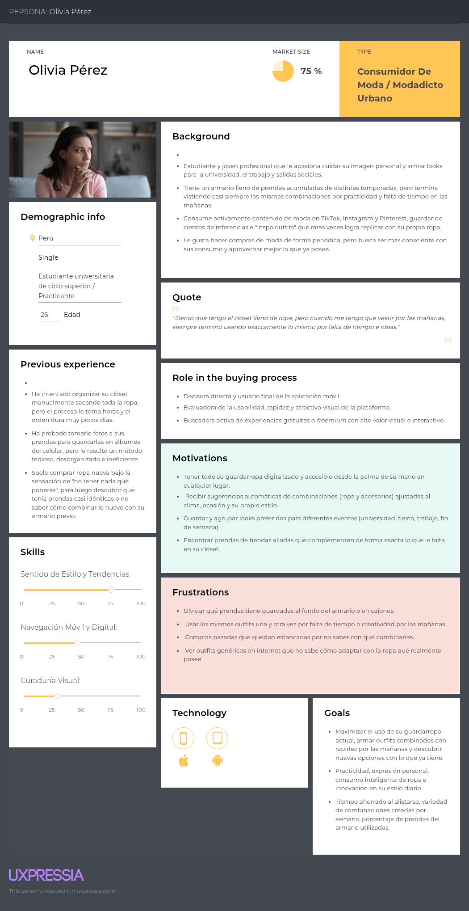
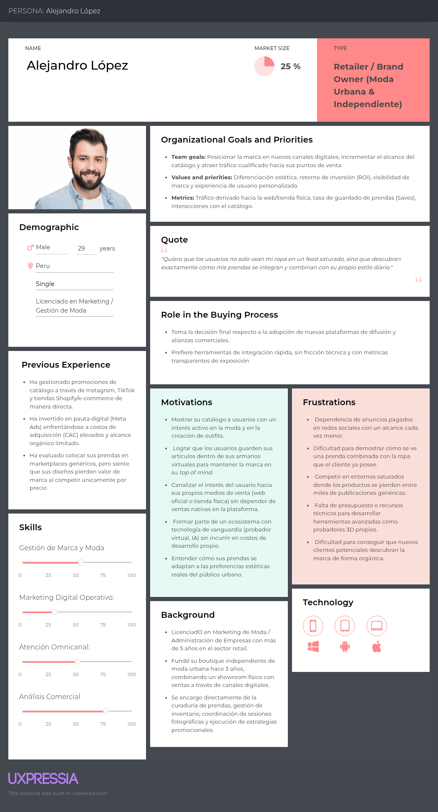
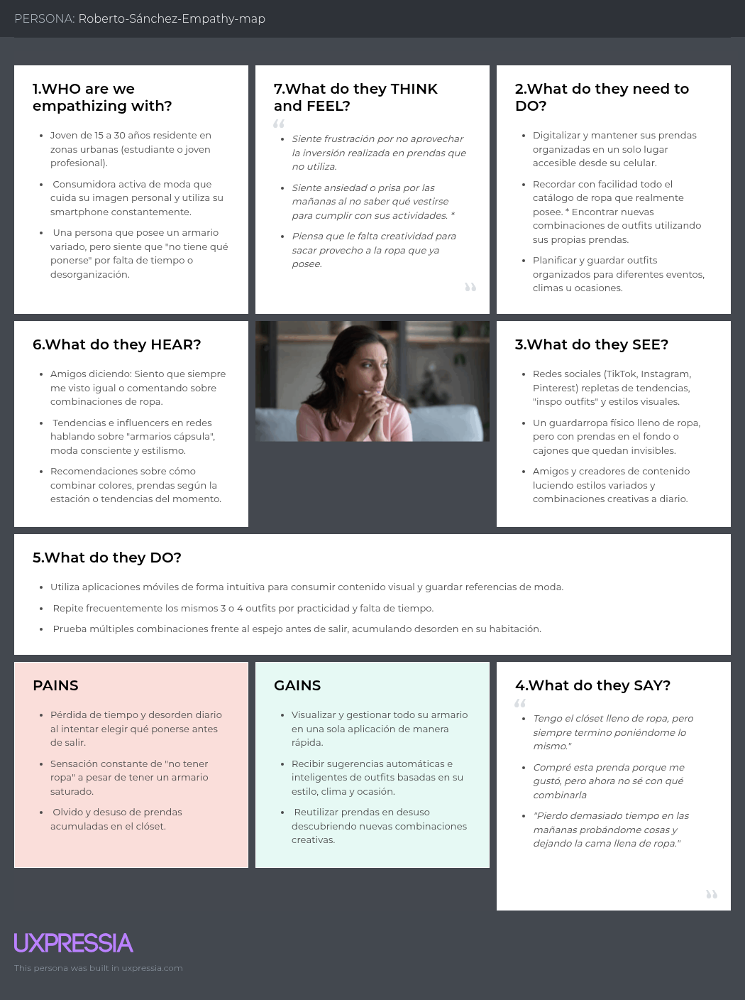
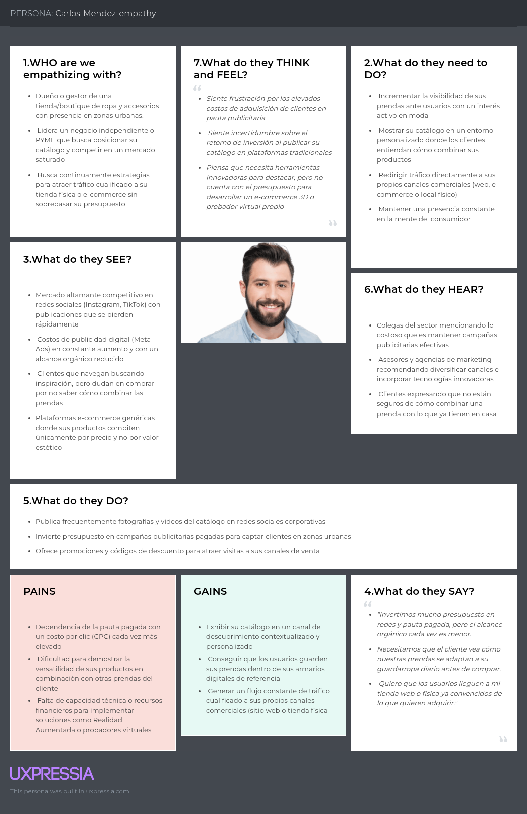
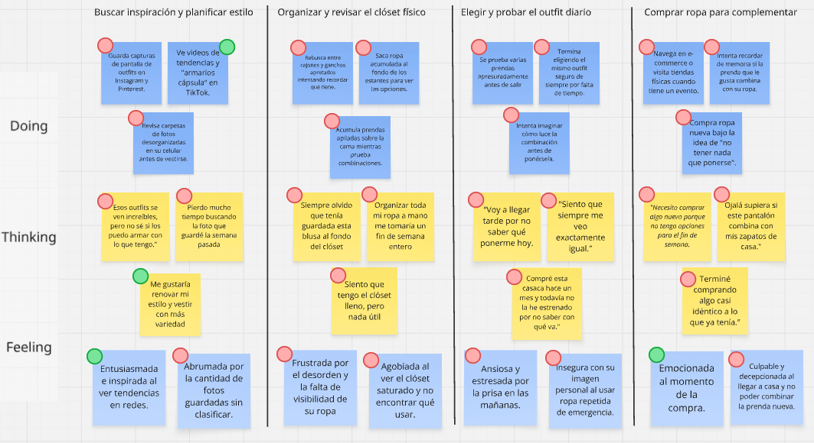
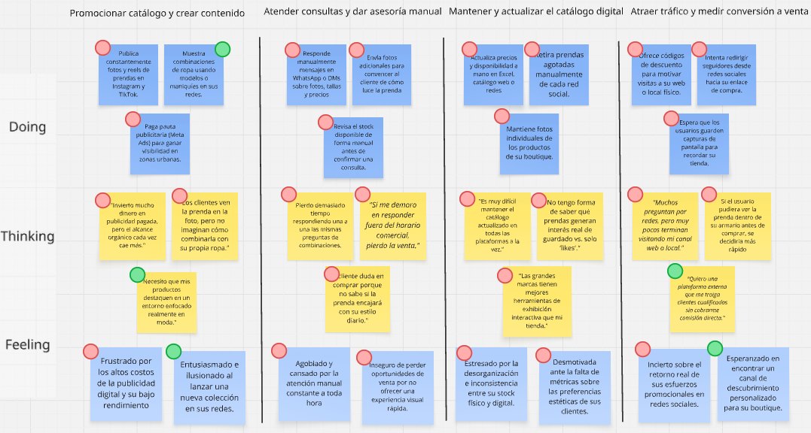
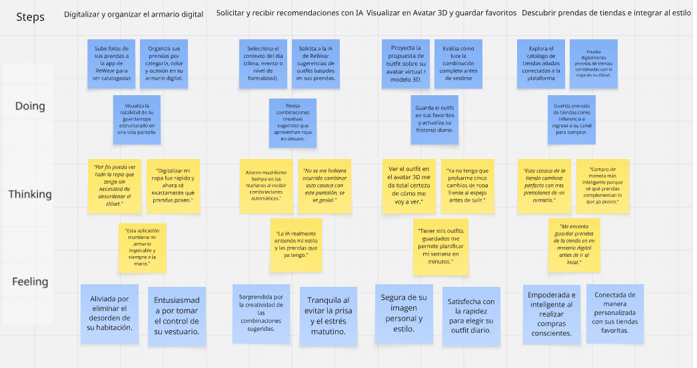
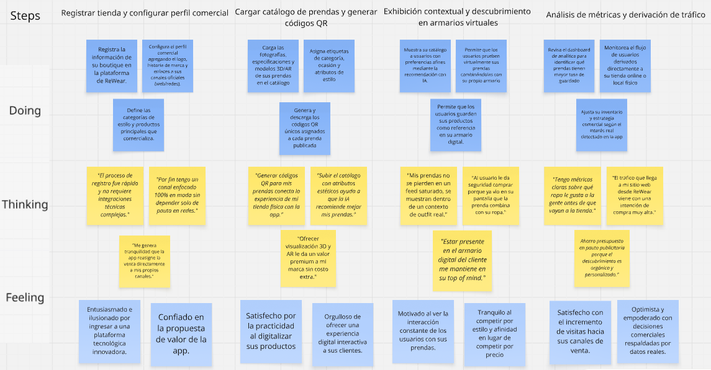

  

<h4>UNIVERSIDAD PERUANA DE CIENCIAS APLICADAS</h4>
<h4>INGENIERIA DE SOFTWARE</h4>
<h4>CICLO 8</h4>
<h4>CURSO:</h4>
<h4>1ASI0728 – ARQUITECTURAS DE SOFTWARE EN TECNOLOGIAS EMERGENTES</h4>
<h4>NRC: 9077</h4>
<h4>PROFESOR(A): Marino Humberto Jara Palacios</h4>
<h4>INFORME DE TB1</h4>
<h4>CICLO: 2026-20</h4>

 

<h4>STARTUP:</h4>
<h4>PRODUCTO:</h4>
<h4>INTEGRANTES:</h4>

- Cabanillas Meza, Jose Mateo (u2023) 
- Ortiz Cardenas, Johanna Antuanete (u202310358) 
- Sánchez Manrique, Italo Ludwing (u2023) 
- Sarmiento Medina, Loreley (u202310005) 
- Zegarra López, Renato Sebastián Rubber (u202311558)

 

<h4>SETIEMBRE - 2026</h4>

 
 
 

## Registro de Versiones del Informe

<table>
  <thead>
    <tr>
      <th>Versión</th>
      <th>Fecha</th>
      <th>Autor</th>
      <th>Descripción de modificación</th>
    </tr>
  </thead>
  <tbody>
    <tr>
      <td>TB1</td>
      <td>17/04/2026</td>
      <td>
        - Cabanillas Meza, Jose Mateo  
        - Ortiz Cardenas, Johanna Antuanete  
        - Sánchez Manrique, Italo Ludwing  
        - Sarmiento Medina, Loreley  
        - Zegarra López, Renato Sebastián Rubber
      </td>
      <td>
        - Capítulo I: Introducción (1.1 – 1.3) 
        - Capítulo II: Requirements & Analysis (2.1 – 2.4) 
        - Capítulo III: Requirements Specification (3.1 – 3.4) 
        - Capítulo IV: Strategic-Level Software Design (4.1 – 4.3)
      </td>
    </tr>
  
  </tbody>
</table>

## **Project Report Collaboration Insights**

TB1 (19/09/2026):

## **STUDENT OUTCOME**

ABET – EAC - Srudent Outcome 3 – Trabajo Multidisciplinario - Capacidad de comunicarse efectivamente con un rango de audiencias.

<table border="1">
<thead>
<tr>
<th>Criterio específico</th>
<th>Acciones realizadas</th>
<th>Conclusiones</th>
</tr>
</thead>
<tbody>
<tr>
<td>3.c1. Comunica oralmente con efectividad a diferentes rangos de audiencia.</td>
<td>
<b>Cabanillas Meza, Jose Mateo</b> 
TB1:  
<b>Ortiz Cardenas, Johanna Antuanete</b> 
TB1:  
<b>Sánchez Manrique, Italo Ludwing</b> 
TB1:  
<b>Sarmiento Medina, Loreley</b> 
TB1:  
<b>Zegarra López, Renato Sebastián Rubber</b> 
TB1:
</td>
<td>TB1: </td>
</tr>
<tr>
<td>3.c2. Comunica por escrito con efectividad a diferentes rangos de audiencia.</td>
<td>
<b>Cabanillas Meza, Jose Mateo</b> 
TB1:  
<b>Ortiz Cardenas, Johanna Antuanete</b> 
TB1:  
<b>Sánchez Manrique, Italo Ludwing</b> 
TB1:  
<b>Sarmiento Medina, Loreley</b> 
TB1:  
<b>Zegarra López, Renato Sebastián Rubber</b> 
TB1:
</td>
<td>TB1: </td>
</tr>
</tbody>
</table>

## **Contenido**

- [STUDENT OUTCOME](#student-outcome)
- [CAPÍTULO I: Introducción](#capítulo-i-introducción)
  - [1.1. Startup Profile](#11-startup-profile)
      - [1.1.1. Descripción de la Startup](#111-descripción-de-la-startup)
      - [1.1.2. Perfiles de integrantes del equipo](#112-perfiles-de-integrantes-del-equipo)
  - [1.2. Solution Profile](#12-solution-profile)
      - [1.2.1. Antecedentes y problemática](#121-antecedentes-y-problemática)
      - [1.2.2. Lean UX Process](#122-lean-ux-process)
        - [1.2.2.1. Lean UX Problem Statements](#1221-lean-ux-problem-statements)
        - [1.2.2.2. Lean UX Assumptions](#1222-lean-ux-assumptions)
        - [1.2.2.3. Lean UX Hypothesis](#1223-lean-ux-hypothesis)
        - [1.2.2.4. Lean UX Canvas](#1224-lean-ux-canvas)
  - [1.3. Segmentos objetivo](#13-segmentos-objetivo)
 
- [CAPÍTULO II: Requirements & Analysis](#capítulo-ii-requirements--analysis)
  - [2.1. Competidores](#21-competidores)
    - [2.1.1 Análisis de Competidores](#211-análisis-de-competidores)
    - [2.1.2. Estrategias frente a competidores](#212-estrategias-frente-a-competidores)
  - [2.2. Entrevistas](#22-entrevistas)
    - [2.2.1 Diseño de entrevistas](#221-diseño-de-entrevistas)
    - [2.2.2 Registro de entrevistas](#222-registro-de-entrevistas)
    - [2.2.3 Análisis de entrevistas](#223-análisis-de-entrevistas)
  - [2.3. Needfinding](#23-needfinding)
    - [2.3.1. User Personas](#231-user-personas)
    - [2.3.2. User Task Matrix](#232-user-task-matrix)
    - [2.3.3. Empathy Mapping](#233-empathy-mapping)
    - [2.3.4. As-is Scenario Mapping](#234-as-is-scenario-mapping)
    - [2.4.	Ubiquitous Language.](#24-ubiquitous-language)
      
 - [CAPÍTULO III: Requirements Specification](#capítulo-iii-requirements-specification)
    - [3.1. To-Be Scenario Mapping](#31-to-be-scenario-mapping)
    - [3.2. User Stories](#32-user-stories)
    - [3.3. Impact Mapping](#33-impact-mapping)
    - [3.4. Product Backlog](#34-product-backlog)
      
 - [CAPÍTULO IV: Strategic-Level Software Design](#capítulo-iv-strategic-level-software-design)
  - [4.1. Strategic-Level Attribute-Driven Design](#41-strategic-level-attribute-driven-design)
    - [4.1.1. Design Purpose](#411-design-purpose)
    - [4.1.2. Attribute-Driven Design Inputs](#412-attribute-driven-design-inputs)
      - [4.1.2.1. Primary Functionality (Primary User Stories)](#4121-primary-functionality-primary-user-stories)
      - [4.1.2.2. Quality Attribute Scenarios](#4122-quality-attribute-scenarios)
      - [4.1.2.3. Constraints](#4123-constraints)
    - [4.1.3. Architectural Drivers Backlog](#413-architectural-drivers-backlog)
    - [4.1.4. Architectural Design Decisions](#414-architectural-design-decisions)
    - [4.1.5. Quality Attribute Scenario Refinements](#415-quality-attribute-scenario-refinements)
  - [4.2. Strategic-Level Domain-Driven Design](#42-strategic-level-domain-driven-design)
    - [4.2.1. EventStorming](#421-eventstorming)
    - [4.2.2. Candidate Context Discovery](#422-candidate-context-discovery)
    - [4.2.3. Domain Message Flows Modeling](#423-domain-message-flows-modeling)
    - [4.2.4. Bounded Context Canvases](#424-bounded-context-canvases)
    - [4.2.5. Context Mapping](#425-context-mapping)
  - [4.3. Software Architecture](#43-software-architecture)
    - [4.3.1. Software Architecture System Landscape Diagram](#431-software-architecture-system-landscape-diagram)
    - [4.3.2. Software Architecture Context Level Diagrams](#432-software-architecture-context-level-diagrams)
    - [4.3.3. Software Architecture Container Level Diagrams](#433-software-architecture-container-level-diagrams)
    - [4.3.4. Software Architecture Deployment Diagrams](#434-software-architecture-deployment-diagrams)

- [Conclusiones](#conclusiones)
- [Conclusiones y Recomendaciones](#conclusiones-y-recomendaciones)
  
- [Bibliografía](#bibliografía)
- [Anexos](#anexos)

# CAPÍTULO I: Introducción

## 1.1. Startup Profile

### 1.1.1. Descripción de la Startup

### 1.1.2. Perfiles de integrantes del equipo

## 1.2. Solution Profile

### 1.2.1. Antecedentes y problemática

### 1.2.2. Lean UX Process

#### 1.2.2.1. Lean UX Problem Statements

#### 1.2.2.2. Lean UX Assumptions

#### 1.2.2.3. Lean UX Hypothesis

#### 1.2.2.4. Lean UX Canvas

## 1.3. Segmentos objetivo

# CAPÍTULO II: Requirements & Analysis

## 2.1. Competidores

### 2.1.1 Análisis de Competidores

### 2.1.2. Estrategias frente a competidores

## 2.2. Entrevistas

De acuerdo con Easwaramoorthy y Zarinpoush (2006), las entrevistas son un método de investigación en el que se lleva a cabo una conversación orientada a recolectar información. A través de este método, se plantean una serie de preguntas que permiten conocer con mayor profundidad las experiencias, necesidades, comportamientos y puntos de vista de los participantes respecto a una problemática determinada.

Para Mirage, la información recogida mediante las entrevistas es fundamental para comprender las dificultades que presentan los consumidores de moda al momento de organizar sus prendas, recordar qué tienen disponible, encontrar nuevas formas de combinar su ropa y descubrir prendas que se adapten a su estilo. Asimismo, permitirá conocer las necesidades de las tiendas de ropa relacionadas con la visibilidad de sus productos, la promoción de sus catálogos y el uso de canales digitales para llegar a potenciales clientes.

Por ello, se plantea realizar un total de **3 entrevistas por cada segmento objetivo**, considerando tanto consumidores de moda como representantes de tiendas de ropa. Las entrevistas podrán realizarse de manera presencial o a distancia mediante herramientas digitales como Google Meet, Zoom o Discord, procurando en ambos casos generar un ambiente cómodo y adecuado que permita a los participantes expresar libremente sus experiencias y opiniones.

### 2.2.1 Diseño de entrevistas

## **Segmento objetivo #1: Consumidores de moda**

### **Preguntas principales:**

- ¿Cómo organizas actualmente las prendas que tienes en tu armario?
- ¿Con qué frecuencia recuerdas qué prendas tienes disponibles al momento de elegir qué vestir?
- ¿Qué dificultades encuentras al momento de elegir un outfit para una ocasión determinada?
- ¿Qué haces actualmente cuando quieres encontrar nuevas formas de combinar las prendas que ya tienes?
- ¿Con qué frecuencia utilizas prendas que tienes guardadas pero que usas poco?
- ¿Has tenido situaciones en las que compraste una prenda y luego descubriste que ya tenías otras prendas similares?
- ¿Qué medios utilizas actualmente para buscar inspiración sobre outfits, estilos o combinaciones de ropa?
- ¿Qué información consideras importante para decidir si una prenda combina con tu estilo o con otras prendas que ya tienes?
- ¿Has utilizado alguna aplicación o herramienta digital para organizar tu ropa, crear outfits o buscar inspiración? ¿Cómo fue tu experiencia?
- ¿Qué características esperarías de una aplicación que te permita registrar y organizar digitalmente las prendas de tu armario?
- ¿Qué tan útil sería para ti recibir sugerencias de outfits basadas en las prendas que ya tienes? ¿Por qué?
- ¿Qué factores considerarías importantes para confiar en las recomendaciones realizadas por una aplicación?
- ¿Qué opinas de poder visualizar digitalmente cómo podría verse una prenda o combinación antes de decidir utilizarla?
- ¿En qué situaciones considerarías útil utilizar realidad aumentada o una representación digital de una prenda?
- ¿Qué información te gustaría encontrar cuando descubres una prenda de una tienda dentro de una aplicación de moda?

### **Preguntas complementarias:**

- ¿Qué tipo de prendas te resulta más difícil combinar?
- ¿Qué haces cuando tienes una prenda que te gusta pero no sabes con qué combinarla?
- ¿Sueles planificar tus outfits con anticipación o decides qué vestir en el momento?
- ¿Qué aplicaciones relacionadas con moda utilizas actualmente y qué es lo que más valoras de ellas?
- ¿Qué haría que dejaras de utilizar una aplicación para organizar tu armario?
- Si pudieras mejorar una sola cosa de la forma en que actualmente eliges tus outfits, ¿qué cambiarías?

## **Segmento objetivo #2: Tiendas de ropa**

### **Preguntas principales:**

- ¿Cómo muestran actualmente sus prendas y productos a sus clientes?
- ¿Qué canales digitales utilizan actualmente para promocionar su catálogo?
- ¿Qué dificultades encuentran al momento de conseguir que sus productos tengan mayor visibilidad?
- ¿Cómo identifican actualmente qué productos generan mayor interés entre sus clientes?
- ¿Qué estrategias utilizan para llegar a nuevos clientes interesados en sus productos?
- ¿Qué importancia tiene para su negocio que una prenda sea mostrada dentro de un contexto relacionado con el estilo del cliente?
- ¿Han utilizado alguna plataforma digital adicional a sus redes sociales o página web para promocionar sus productos? ¿Cómo fue la experiencia?
- ¿Qué información consideran importante mostrar de una prenda para que un usuario pueda conocerla mejor?
- ¿Qué beneficios y dificultades encontrarían al registrar parte de su catálogo en una plataforma digital externa?
- ¿Qué características tendría que ofrecer una plataforma para que consideraran útil mostrar sus productos en ella?
- ¿Qué opinan de una plataforma que permita a los usuarios descubrir prendas de diferentes tiendas según sus preferencias y estilo?
- ¿Qué valor tendría para su negocio que un usuario pueda guardar una de sus prendas como referencia dentro de su armario digital?
- ¿Qué información o métricas les gustaría conocer sobre las personas que interactúan con sus productos dentro de una plataforma?
- ¿Qué opinan de utilizar representaciones digitales o tridimensionales para mostrar determinadas prendas?
- ¿Considerarían útil que los usuarios puedan visualizar digitalmente una prenda antes de visitar el canal de la tienda? ¿Por qué?

### **Preguntas complementarias:**

- ¿Qué tipo de prendas consideran que necesitan mayor promoción o visibilidad?
- ¿Qué redes sociales o plataformas les generan actualmente mayor interacción con sus clientes?
- ¿Qué dificultades encuentran al mantener actualizado su catálogo digital?
- ¿Qué información necesitarían de una plataforma para evaluar si realmente les genera valor?
- ¿Qué condiciones tendrían que cumplirse para que confiaran en una plataforma que muestre sus productos?
- ¿Qué funcionalidades adicionales les gustaría encontrar en una plataforma digital orientada a la promoción de moda?

### 2.2.2 Registro de entrevistas

### 2.2.3 Análisis de entrevistas

## 2.3. Needfinding

### 2.3.1. User Personas

En esta sección, el equipo presenta los User Personas realizados

### Olivia Rodriguez

/

--- 

### Alejandro Lopez

/

---

### 2.3.2. User Task Matrix

En esta sección se detallan las tareas clave que realizan los diferentes segmentos de usuarios representados por los **User Personas** de **ReWear**, con el objetivo de cumplir sus metas relacionadas con la organización del armario digital, el descubrimiento de outfits mediante Inteligencia Artificial, la prueba virtual en avatar 3D y la visibilidad de catálogos comerciales para tiendas aliadas.

| Persona | Actividad | Frecuencia | Importancia |
|---|---|---|---|
| **Olivia Rodríguez - Consumidor de moda** | Digitalizar prendas en el armario virtual mediante captura de foto o carga | Frecuentemente | Alta |
| | Solicitar recomendaciones automáticas de outfits a la IA según el contexto (clima, evento) | Diariamente | Alta |
| | Probar combinaciones de ropa y accesorios sobre su avatar 3D personalizado | Frecuentemente | Alta |
| | Guardar y organizar outfits favoritos en colecciones personalizadas | Frecuentemente | Media |
| | Escanear códigos QR en tiendas para vincular prendas de catálogo a su armario | Ocasionalmente | Media |
| | Explorar el armario virtual de amigos e interactuar con prendas compartidas | Ocasionalmente | Media |
| **Alejandro López - Owner de boutique / Tienda de ropa** | Registrar y cargar prendas del catálogo comercial en la plataforma | Ocasionalmente | Alta |
| | Generar códigos QR comerciales para etiquetado en tiendas físicas o e-commerce | Ocasionalmente | Alta |
| | Monitorear métricas de rendimiento (veces guardada la prenda, pruebas en avatar) | Frecuentemente | Alta |
| | Actualizar información, fotos o etiquetas de prendas registradas | Ocasionalmente | Media |
| | Evaluar el tráfico derivado desde la plataforma hacia sus propios canales de venta | Frecuentemente | Alta |

### 2.3.3. Empathy Mapping

En esta sección , el equipo presenta los mapas de empatia o Empathy Maps realizados por User Persona

### Olivia Rodriguez

/

---

### Alejandro Lopez

/

---

### 2.3.4. As-is Scenario Mapping

En esta sección, el equipo presenta los escnerarios as is para sus respectivos users personas

### Olivia Rodriguez

---

### Alejandro Lopez

---

## 2.4. Ubiquitous Language

# CAPÍTULO III: Requirements Specification

## 3.1. To-Be Scenario Mapping

En esta sección , el equipo muestra los artecfactos To-Be Scenario Maps 

### Olivia Rodriguez

---

### Alejandro Lopez

---
## 3.2. User Stories

## 3.3. Impact Mapping

## 3.4. Product Backlog

# CAPÍTULO IV: Strategic-Level Software Design

## 4.1. Strategic-Level Attribute-Driven Design

### 4.1.1. Design Purpose

### 4.1.2. Attribute-Driven Design Inputs

#### 4.1.2.1. Primary Functionality (Primary User Stories)

#### 4.1.2.2. Quality Attribute Scenarios

#### 4.1.2.3. Constraints

### 4.1.3. Architectural Drivers Backlog

### 4.1.4. Architectural Design Decisions

### 4.1.5. Quality Attribute Scenario Refinements

## 4.2. Strategic-Level Domain-Driven Design

### 4.2.1. EventStorming

### 4.2.2. Candidate Context Discovery

### 4.2.3. Domain Message Flows Modeling

### 4.2.4. Bounded Context Canvases

### 4.2.5. Context Mapping

## 4.3. Software Architecture

### 4.3.1. Software Architecture System Landscape Diagram

### 4.3.2. Software Architecture Context Level Diagrams

### 4.3.3. Software Architecture Container Level Diagrams

### 4.3.4. Software Architecture Deployment Diagrams

# Conclusiones
# Conclusiones y Recomendaciones

# Bibliografía

# Anexos
